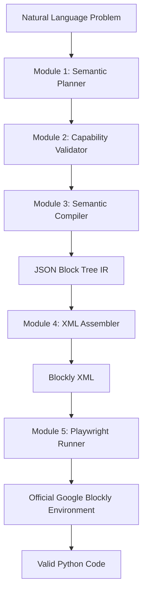

# Google Blockly Agent: Automated Program Synthesis Pipeline

The **Google Blockly Agent** is a sophisticated program synthesis engine designed to bridge the gap between natural language problem statements and executable code. It uses a 5-phase deterministic pipeline to convert abstract requirements into validated Blockly XML and idiomatic Python code.

---

## 🏗 Repository Architecture

The project is split into two primary environments that communicate via structured JSON artifacts:

1.  **Python (Brain)**: Handles semantic reasoning, algorithmic planning, and structural validation.
2.  **Node.js/Playwright (Execution)**: Handles visual block assembly, official Blockly rendering, and Python code generation.

### High-Level Interaction Flow



---

## ⚡ The 5-Phase Pipeline

### Phase 1: Semantic Planning (`/semantic`)
- **Question Expansion**: Uses `question_expander.py` (LLM-backed) to turn vague user queries into formal technical specifications.
- **Skeleton Classification**: The `SemanticPlanner` matches the problem to a predefined **Algorithmic Skeleton** (e.g., `FOREACH_AGGREGATE`, `LINEAR_SEARCH`) defined in `schema.py`.
- **Slot Filling**: An LLM fills placeholders in the skeleton (e.g., comparison operators, initial values) to create a concrete **Semantic Plan**.

### Phase 2: Validation & Compilation (`/semantic`)
- **Capability Validation**: `validator.py` checks the Semantic Plan against `data/normalized_blocks.json`. It ensures every operation identified by the LLM has a corresponding block in the restricted vocabulary.
- **IR Compilation**: `compiler.py` translates the validated plan into a **Block Tree (Intermediate Representation)**. This IR is a nested JSON structure that mirrors the hierarchical nature of Blockly blocks.

### Phase 3: XML Assembly (`/assembler`)
- **Recursive Building**: `generate_xml.js` (Node.js) reads the Block Tree.
- **Mapping**: `xml_builder.js` uses a `BLOCK_TYPE_MAP` to convert semantic types (like `assign` or `foreach`) into specific Blockly XML tags (like `variables_set` or `controls_forEach`).
- **Synchronization**: The resulting XML is written to `local_blockly/program.xml` to prepare for visual execution.

### Phase 4: Visual Execution & Generation (`/runner`)
- **Headful Playwright**: `runner_execute.js` launches a Chromium browser and loads the local `local_blockly/index.html` playground.
- **Native Generation**: The system injects `execute_xml.js` into the browser, which uses the official `Blockly.Python.workspaceToCode` generator. This guarantees that the Python code is perfectly synced with the visual block representation.
- **Visual Verification**: The browser stays open for 5 seconds (configurable) to allow developers to see the blocks "snapped" into place.

### Phase 5: Output & Fallback (`main.py`)
- **Persistence**: Results are gathered from the runner and organized into the `outputs/Problem_PID/` directory.
- **Deterministic naming**: Files follow the format `{TEAM_ID}_TL_{PID}.xml` and `{TEAM_ID}_TL_{PID}.txt`.
- **LLM Fallback**: If the strict pipeline fails at any point (e.g., validation error), the system triggers `fallback_llm/` to generate a best-guess result, ensuring the batch process continues.

---

## 📂 Directory & File Reference

| Directory | Primary Responsibility | Key Files |
| :--- | :--- | :--- |
| `/semantic` | Planning, Schema, and Compilation | `planner.py`, `compiler.py`, `schema.py` |
| `/assembler` | IR-to-XML translation (Node.js) | `generate_xml.js`, `xml_builder.js` |
| `/runner` | Headful Playwright execution | `runner_execute.js`, `execute_xml.js` |
| `/local_blockly` | Static Blockly playground environment | `index.html`, `program.xml` |
| `/data` | Static configuration and block metadata | `normalized_blocks.json` |
| `/outputs` | Final generated assets per problem | `Problem_PID/` subfolders |
| `/tools` | Auxiliary integrations (e.g., Gmail) | `gmail/` source code |

---

## 🚀 Getting Started

1.  **Install Dependencies**:
    ```bash
    pip install -r requirements.txt
    npm install
    npx playwright install chromium
    ```
2.  **Environment Setup**:
    Add `OPENROUTER_API_KEY` to a `.env` file in the root.
3.  **Run the Pipeline**:
    - Batch Mode: `python main.py`
    - Test Mode: `python main.py --test`
